# Catalog

Browse the library by category. Every project ships a native `.appstudio` file
(load straight into App Studio via **Share → Import**) plus the raw source for
copy-paste and reading.

## Who it's for

Founders, investors, managers, sales people, marketers, teachers, presenters,
finance people, spreadsheet / Miro / graph / infographic makers, influencers,
and anyone who wants to make a quick prototype of an app idea.

## Gallery

| | | |
|---|---|---|
|  **Price calculator** |  **UX retention simulator** | [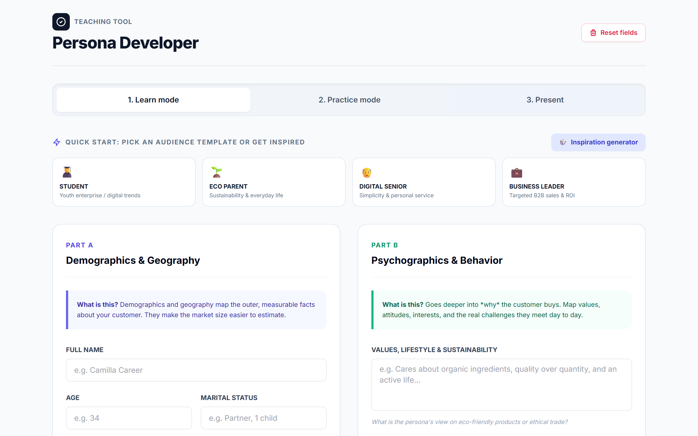](projects/persona-developer/) **Persona developer** |
|  **Habit tracker** |  **Color palette** |  **Quiz game** |
|  **SaaS prototype** | [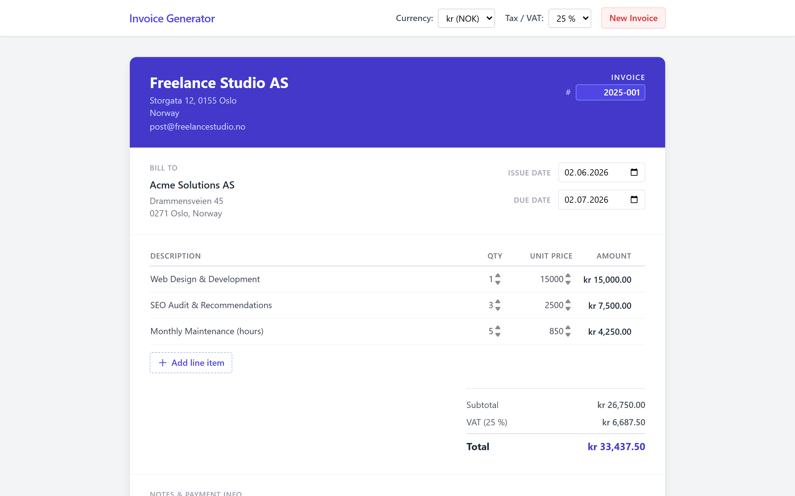](projects/invoice-generator/) **Invoice generator** | [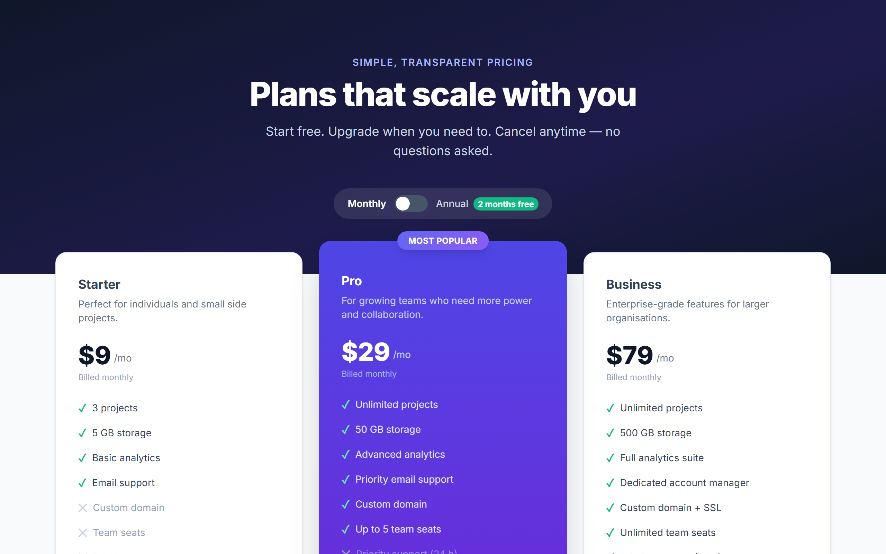](projects/pricing-page/) **Pricing page** |
| [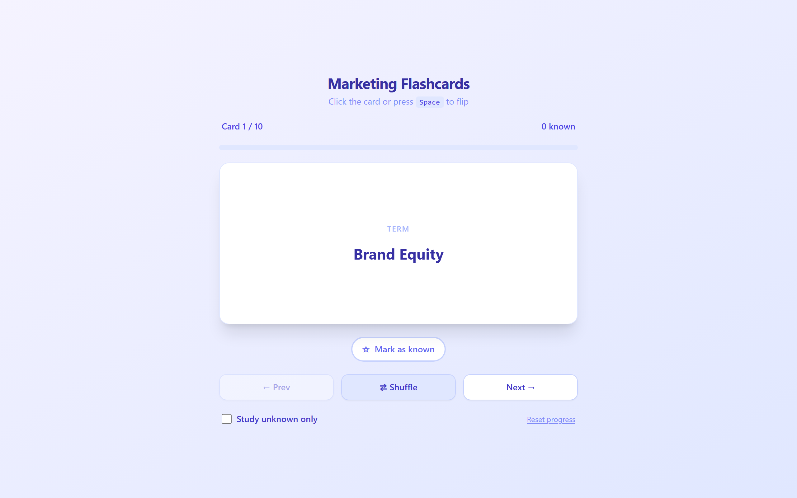](projects/flashcards/) **Flashcards** |  **Pomodoro timer** | [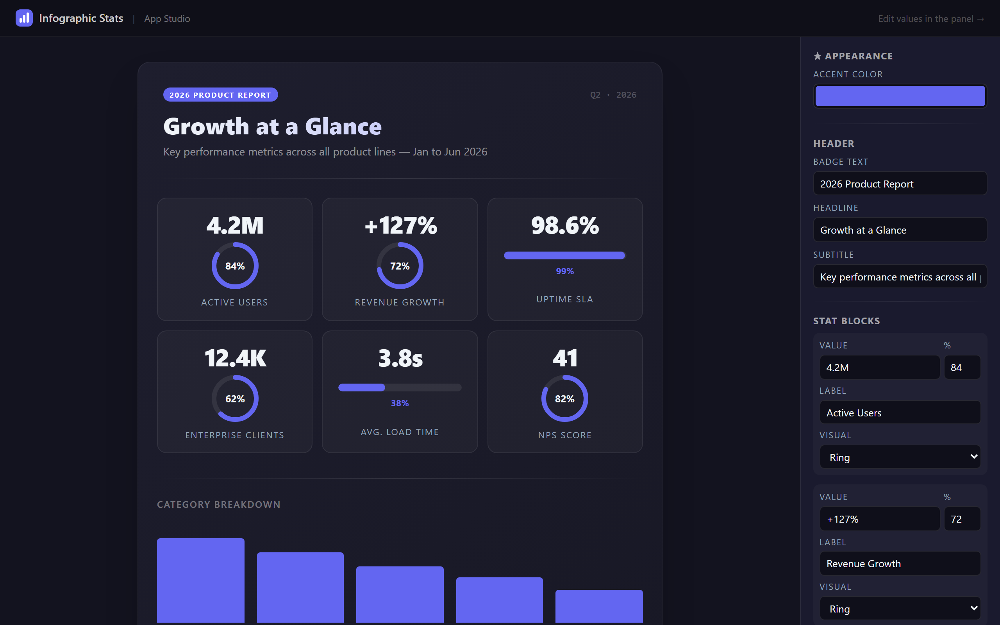](projects/infographic-stats/) **Infographic stats** |
| [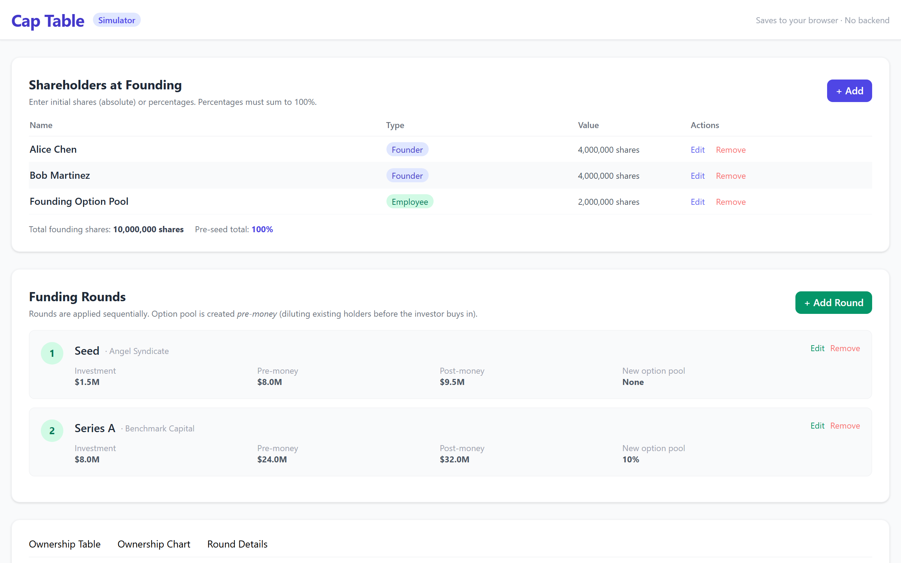](projects/cap-table-simulator/) **Cap table simulator** | [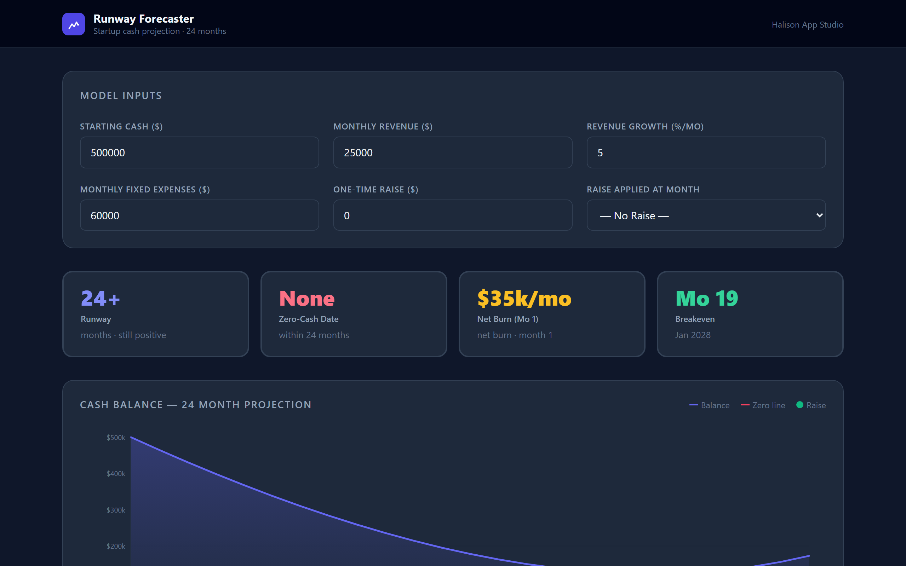](projects/runway-forecaster/) **Runway forecaster** |  **Loan amortization** |
|  **Quote builder** | [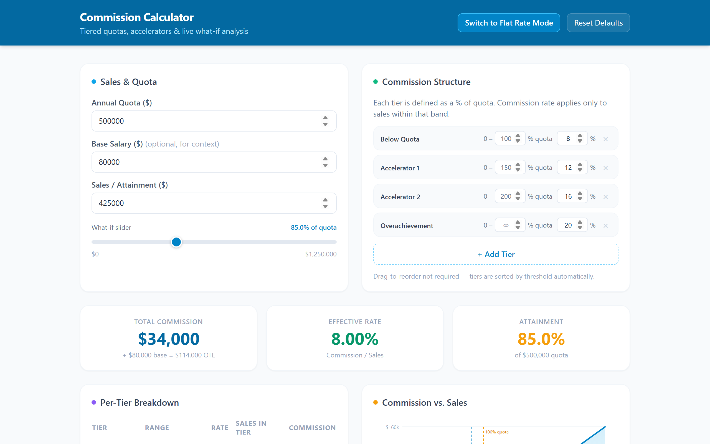](projects/commission-calculator/) **Commission calculator** | [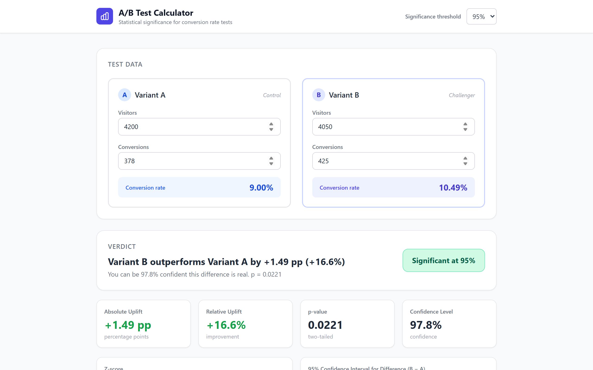](projects/ab-test-calculator/) **A/B test calculator** |
| [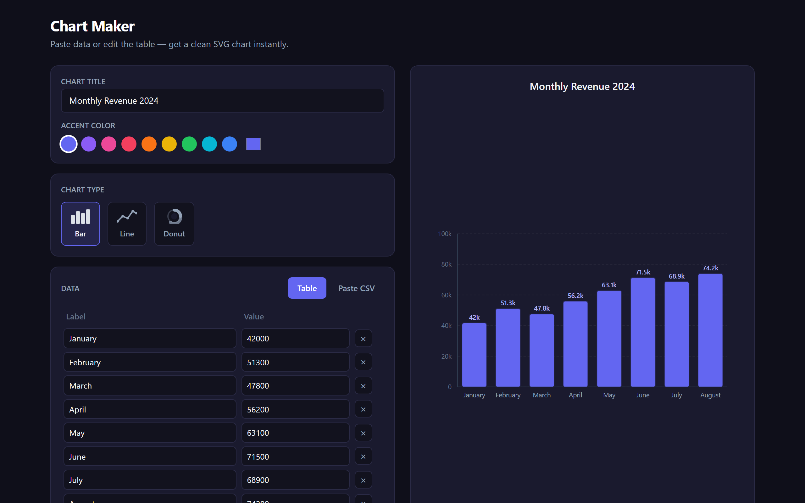](projects/chart-maker/) **Chart maker** |  **Gantt chart** |  **Rubric grader** |
| [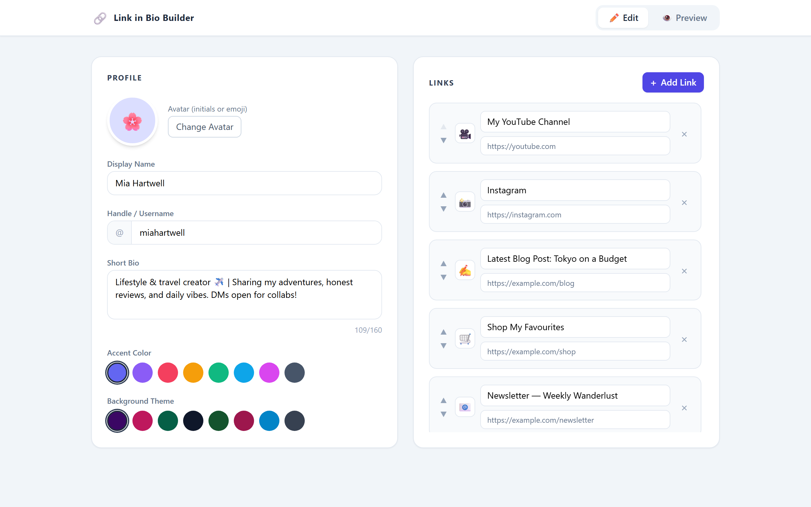](projects/link-in-bio/) **Link in bio** | | |

*(`tip-calculator` and `sales-dashboard` are React components — they render inside App Studio.)*

## Projects

| Project | Category | Shape | Languages | Prompt |
|---------|----------|-------|-----------|--------|
| [tip-calculator](projects/tip-calculator/) | Personal / utility | React | EN | — |
| [price-calculator](projects/price-calculator/) | Educational · Business | HTML | EN, NB | [prompt](prompts/examples/price-calculator.md) |
| [ux-retention-simulator](projects/ux-retention-simulator/) | Business · Data | HTML | EN | [prompt](prompts/examples/ux-retention-simulator.md) |
| [persona-developer](projects/persona-developer/) | Educational | HTML | EN, NB | [prompt](prompts/examples/persona-developer.md) |
| [habit-tracker](projects/habit-tracker/) | Personal | HTML | EN | [starter](prompts/context/personal.md) |
| [sales-dashboard](projects/sales-dashboard/) | Data / dashboard | React | EN | [starter](prompts/context/data-dashboard.md) |
| [color-palette](projects/color-palette/) | Creative | HTML | EN | [starter](prompts/context/creative.md) |
| [quiz-game](projects/quiz-game/) | Game / quiz | HTML | EN | [starter](prompts/context/game-quiz.md) |
| [saas-prototype](projects/saas-prototype/) | Prototype | HTML | EN | [starter](prompts/context/prototype.md) |
| [invoice-generator](projects/invoice-generator/) | Business / finance | HTML | EN | — |
| [pricing-page](projects/pricing-page/) | Business / sales | HTML | EN | — |
| [flashcards](projects/flashcards/) | Educational | HTML | EN | — |
| [pomodoro-timer](projects/pomodoro-timer/) | Personal | HTML | EN | — |
| [infographic-stats](projects/infographic-stats/) | Creative | HTML | EN | — |
| [cap-table-simulator](projects/cap-table-simulator/) | Business / finance | HTML | EN | — |
| [runway-forecaster](projects/runway-forecaster/) | Business / finance | HTML | EN | — |
| [loan-amortization](projects/loan-amortization/) | Business / finance | HTML | EN | — |
| [quote-builder](projects/quote-builder/) | Business / sales | HTML | EN | — |
| [commission-calculator](projects/commission-calculator/) | Business / sales | HTML | EN | — |
| [ab-test-calculator](projects/ab-test-calculator/) | Business / marketing | HTML | EN | — |
| [chart-maker](projects/chart-maker/) | Data / visual | HTML | EN | — |
| [gantt-chart](projects/gantt-chart/) | Business / managers | HTML | EN | — |
| [rubric-grader](projects/rubric-grader/) | Educational | HTML | EN | — |
| [link-in-bio](projects/link-in-bio/) | Creative | HTML | EN | — |

## Categories (prompt add-ons)

Upload one of these to your AI alongside [`prompts/authoring-guide.md`](prompts/authoring-guide.md),
then write a short prompt. See [`prompts/context/`](prompts/context/).

| Add-on | For |
|--------|-----|
| `educational` | teachers, presenters — Learn / Practice / Present |
| `business` | founders, investors, managers, sales, finance |
| `personal` | private localStorage-first trackers and planners |
| `data-dashboard` | finance, analysts, spreadsheet / graph makers |
| `creative` | marketers, designers, influencers, infographic makers |
| `game-quiz` | teachers, marketers, presenters |
| `prototype` | founders, PMs, designers prototyping app ideas |

## Validating

Run `node scripts/validate.mjs` (or `npm run validate`) to check that every
project's `.appstudio`, source, and header are well-formed. See
[CONTRIBUTING.md](CONTRIBUTING.md).
