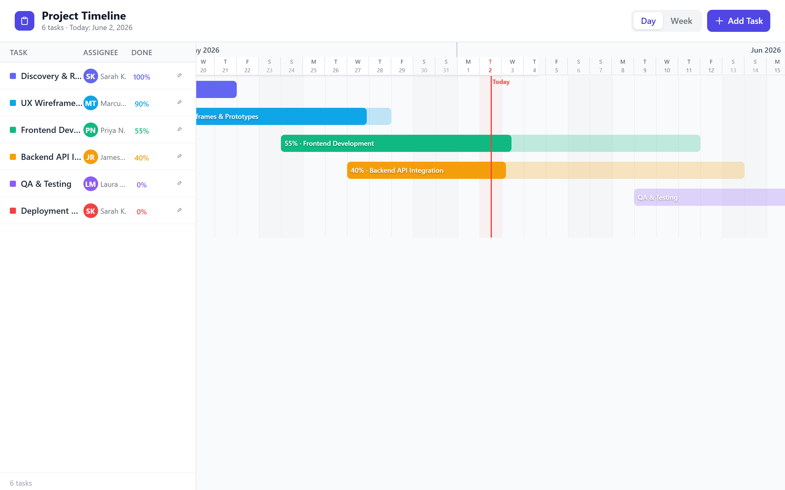

# Gantt Chart

A project timeline: tasks with dates, duration, **% complete**, and assignees,
drawn as bars on a scaled time grid with a "today" line and a Day / Week view.

A single self-contained HTML page (Tailwind via CDN). Category: **business**
(managers, project leads).

## Load it into App Studio

- **Load it straight in** — use [`gantt-chart.appstudio`](./gantt-chart.appstudio):
  **Share → Import**, or drop it into your `App Studio Projects` folder.
- **Copy-paste** — open [`gantt-chart.html`](./gantt-chart.html), copy it all,
  then **New → paste → Run App**.

## Notes

- Add / edit / remove tasks; the time axis auto-scales to span them. **No runtime
  service dependency**; saved in `localStorage`.
- Keep the header comment and the source link at the top of the file. See the
  root [LICENSE](../../LICENSE) for the terms.
